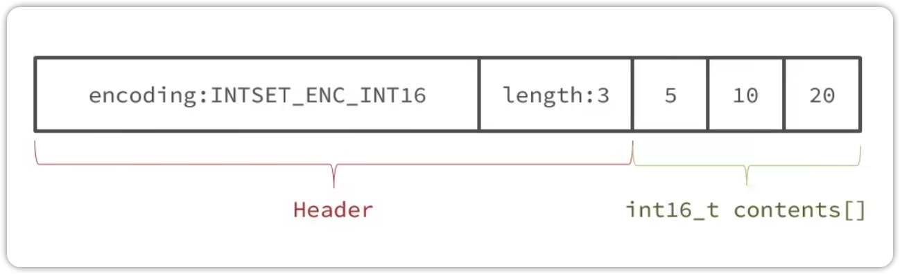

# 概述

在 Redis中，IntSet（整数集合）是一种用来保存整数值集合的抽象数据结构，当一个集合只包含整数值元素，并且元素数量不多的时候，Redis 就会用 IntSet 来存储该集合。

# IntSet 的数据结构

```c
typedef struct intset {
	uint32_t encoding; // 编码方式，支持16位，32位，64位整数，对应 short、int、long
	uint32_t length; // 元素个数
	int8_t contents[]; // 整数数组，保存集合数据
} intset; 
```

* `encoding`：表示 IntSet 的编码方式，它决定了`contents`数组中每个元素的类型。Redis 支持三种长度的编码

```c
#define INTSET_ENC_INT16 (sizeof(int16_t)) // 相当于 java short
#define INTSET_ENC_INT32 (sizeof(int32_t)) // 相当于 java int
#define INTSET_ENC_INT64 (sizeof(int64_t)) // 相当于 java long
```

* `length`：表示IntSet 中实际存储的元素的个数
* `contents`：是一个整数数组，数组中的元素按照从小到大的顺序进行排列，这样可以方便进行二分查找




# IntSet 的主要特点

## 内存紧凑

假如 IntSet 的encoding 是 `INTSET_ENC_INT16`，那么数组中每个数字占用的大小都是 16 位，两个字节

文件头占用的大小为 encoding（4 字节） + length （4 字节）

## 有序存储

元素在`contents`数组中按照从小到大的顺序排列，这样能够使用二分查找进行数据查询，时间复杂度为 O(logn)

## 自动升级

每次插入一个新元素，而该新元素无法使用当前编码方式表示的时候，IntSet 会进行自动升级操作，以容纳新元素

# IntSet 添加元素的流程

1. 首先比对要插入的元素的 encoding 与当前 encoding，视情况是否扩容
2. 进行二分查找，如果找到元素则返回；如果未找到元素则判断元素添加的位置，视情况腾出位置给元素
3. 插入元素
4. 更新IntSet 的长度，返回

```c
// intset.c
intset *intsetAdd(intset *is, int64_t value, uint8_t *success) {
	uint8_t valenc = _intsetValueEncoding(value); // 计算要添加的整数所需要的 encoding
	uint32_t pos; // 记录新纪录要插入的位置
	if (success) *success = 1; // 如果传入了 success 指针，则将其初始化为 1，表示添加操作默认为成功
	if (valenc > intrev32ifbe(is -> encoding)) { // 如果大于 IntSet 现在的 encoding
		return intsetUpgradeAndAdd(is, value); // 执行 IntSet 升级
	} else {
		if (intsetSearch(is, value, &pos)) { // 进行二分查找
			if (success) *success = 0; // 找到了元素，success为0表示添加操作失败
			return is; // 返回 intset
		}
    // 如果值不存在，则需要为元素分配新空间
    // intSetResize 函数会重新分配集合的内存，使其能够容纳一个额外的元素
		is = intsetResize(is, intrev32ifbe(is -> length) + 1);
    
    // 如果插入的位置不在集合的末尾，需要将插入位置之后的元素向后移动一位，腾出位置
		if (pos < intrev32ifbe(is -> length)) intsetMoveTail(is, pos, pos + 1);
	}
  // 将新元素插入到指定位置
	_intsetSet(is, pos, value);
  
  // 更新集合的长度
	is -> length = intrev32ifbe(intrev32ifbe(is->length) + 1);
  
  // 返回修改后的整数集合指针
	return is;
}
```

# IntSet 的升级流程

现在，假设有一个IntSet，元素为`{5, 10, 20}`，采用的编码是`INTSET_ENC_INT16`，则每个整数占2个字节
我们向该数组中添加一个数字，50000，这个数字的大小超过了int_16的范围，IntSet会自动升级编码方式到合适的大小

1. 升级编码为INTSET_ENC_INT32，每个整数占4个字节，并按照新的编码方式以及元素个数扩容数组
2. 倒序依次将数组中的元素拷贝到扩容后的正确位置
3. 将待添加的元素放到数组的末尾 
4. 最后修改头信息，将intset的encoding属性改为INTSET_ENC_INT32，将length属性改为4

```c
// intset.c
static intset *insetUpgradeAndAdd(intset *is, int64_t value) {
  uint8_t curenc = intrev32ifbe(is->encoding); // 计算出当前 encoding
  uint8_t newenc = _intsetValueEncoding(value); // 计算出新的 encoding
  int length = intrev32ifbe(is->length); // 计算出当前的 length
  // 如果为负数，prepend 为 1，表示新元素应该插入到集合头部；否则为 0，表示插入到集合尾部
  int prepend = value < 0 ? 1 : 0;
  // 设置 intset 结构体的 encoding 为新的 encoding
  is->encoding = intrev32ifbe(newenc);
  // 重新分配集合的内存，使其能够容纳一个额外的元素·
  is = intsetResize(is, intrev32ifbe(is->length) + 1);
  while (length--)
    // _insetGetEncoded根据旧编码方式获取元素位置
    // _intsetSet根据新编码方式插入到新位置
    _intsetSet(is, length + prepend, _insetGetEncoded(is, length, curenc));
  if (prepend) // 根据 prepend 的值决定将新元素插入到头部还是尾部
    _intsetSet(is, 0, value);
  else
    _intsetSet(is, intrev32ifbe(is->length),value);
  // 更新 intset 的元素长度
  is->length = intrev32ifbe(intrev32ifbe(is->length) + 1);
  return is;
}
```

# 4 应用场景

* 在redis中，set集合数据结构在只存储少量整数的情况下使用的是 IntSet 编码
* 通过配置`set-max-intset-entries 512`可以控制 IntSet 存储的最大元素数量
* 可以通过 `object encoding [key]` 命令查看元素的 encoding
* 如果往set 添加了字符串，在 redis8.0 中，encoding 会变成 `listpack`
# 5 总结

IntSet可以看作是特殊的整数数组，具备一些特点
1. redis会确保intset中的元素唯一，有序
2. 具备类型升级机制，可以节省内存空间
3. 数据按照从小到大的顺序存放
4. 底层采用二分查找的方式来查询