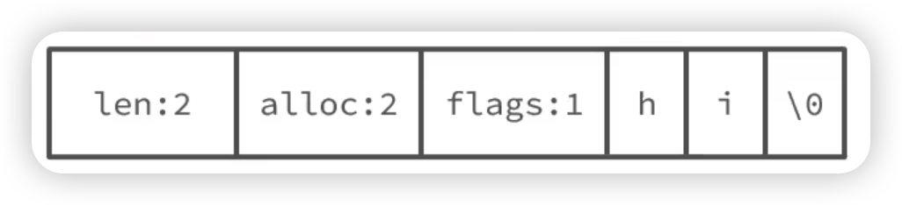

# 概述

我们知道 Redis 是基于 C 语言进行开发的，但是 Redis 字符串底层使用的却不是 C 语言的字符串数据结构，而是自己创建了一种数据结构称为 SDS（Simple Dynamic String，简单动态字符串），这是因为 C 语言的字符串存在许多问题，针对这些问题，Redis 自己定义了 SDS 来解决：

1. 字符串长度的获取
   * C 语言字符串：需要进行遍历运算，直到遇见`'\0'`，时间复杂度 O(n)
   * SDS：在 SDS 的数据结构中，存在属性 len 记录着字符串的长度，时间复杂度 O(1)

2. 缓冲区溢出问题
   * C 语言字符串：由于 C 语言字符串不记录自身长度，在进行字符串拼接操作时，如果没有提前分配足够的内存，就容易发生缓冲区溢出。
   * SDS：SDS 在进行字符串修改操作的时候，会首先检查空间是否足够，如果空间不足够会自动进行扩容，避免缓冲区溢出的风险

3. 内存分配效率
   * C 语言字符串：对 C 语言字符串进行修改时，每次可能都需要重新分配内存并且复制数据，频繁的内存分配和释放操作会带来较大的开销
   * SDS：SDS 采用了空间预分配策略。空间预分配是指在扩容的时候，除了分配所需要的空间，还会额外预先分配一些额外的空间，减少了后续操作时再次进行内存分配的概率。

# SDS 的结构

```c
struct __attribute__ ((__packed__)) sdshdr8 {
  uint_t len; // 表示 buf 数组中保存的字符字节数，不包含结束标识
  uint_t alloc; // 表示 buf 数组申请的总总字节数，不包含结束表示
  unsigned char flags; // 不同 SDS 的头类型，用来控制 SDS 的大小
  char buf[]; // 字符串的底层数组
}
```


属性 flags 的值是预定义好的宏

```c
#define SDS_TYPE_5 0 // 31
#define SDS_TYPE_8 1 // 255
#define SDS_TYPE_16 2 // 65535
#define SDS_TYPE_32 3 // 很长
#define SDS_TYPE_64 4 // 超级长
```


假设我们创建一个4 个字符的字符串 name，该字符串在内存中的结构如下：

len：表示字符串的长度为 4

alloc：表示为 buf 分配的内存空间为 4，不包含结束标识

flag：表示该字符串编码为 SDS_TYPE_8

其后跟随的是 buf 数组的实际存储内容


# SDS动态扩容

假设现在有一个字符串 hi



我们需要修改其字符串的内容，添加上`,amy`，那么这里首先会申请新的内容空间，申请大小为新的字符串长度 * 2 + 1，也就是 6 * 2 + 1 = 13


SDS 的动态扩容规则

* 如果新字符串小于1M，则新空间为扩展后字符串的长度的两倍 + 1
* 如果新字符串大于1M，则新空间为扩展后的字符串的长度 + 1M + 1。称为内存预分配。内存预分配可以减少操作系统在用户态和内核态切换带来的消耗
