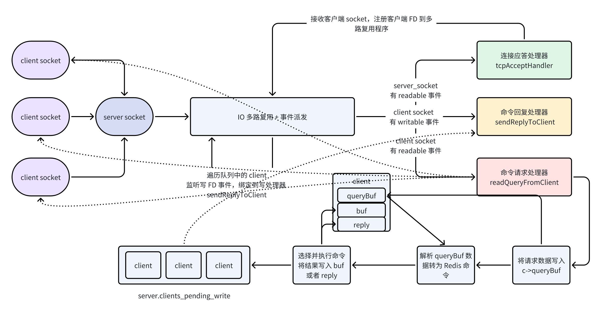
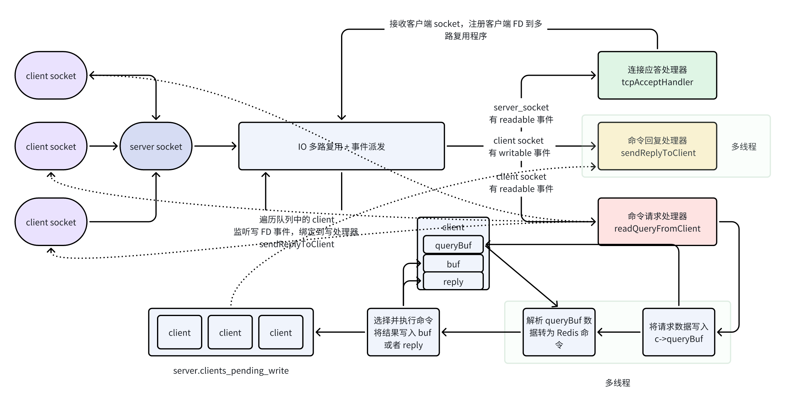

# Redis 网络模型

Redis 在互联网开发领域已经成为缓存技术的事实标准，几乎每个工作要求中都会要求对 Redis 的掌握。我们最常听到的说法是 Redis 是单线程的，其实这句话有些局限。正确来说是 redis 执行命令的这个环境是单线程的。事实上 Redis 耗时的操作例如 RDB 是通过 fork 一个新的进程实现的。并且在 redis6.0 之后，针对网络 IO 瓶颈，Redis 引入了多线程的机制来加快对命令的解析以及命令结果的响应。

# 单线程的 Redis 网络模型

在 Redis 6.0 之前，从命令的解析再到命令执行结果的响应，确实是单线程的。由于 Redis 是在内存中运行的，命令的执行速度往往不是瓶颈。

使用单线程能够有以下优点：（1）避免过多的线程上下文切换；（2）避免同步机制的开销；（3）简单易维护

# 单线程事件循环

从 Redis 1.0 到 6.0 之前，Redis 的核心网络模型一直是单 Reactor 模型，根据不同的操作系统底层实现使用不同的 IO 多路复用技术：Epoll（linux）、Select、kqueue（BSD）。

Redis 中的单线程模型中的一些关键元素

* 主线程：负责处理网络连接、读取客户端请求、执行命令、写回响应数据等操作
* socket 客户端：通过 socket 与服务器建立网络连接，发送请求命令并且接收响应数据
* socket 多路复用器：基于 epoll_wait/select/kevent等系统调用封装，监听读写事件触发，是事件循环的核心功能，是事件驱动的基础
* acceptTcpHandler：连接处理应答器，底层使用系统调用 accept 接受客户端的新链接，并为新连接注册绑定命令读取器，用于后续处理客户端的 TCP 连接
* readQueryFromClient：命令读取处理器，用于解析和执行客户端请求的命令
* beforeSleep：在事件循环进入 aeApiPoll 等待事件到达之前执行的函数，包括一些常规任务，如将client->buf 或者 client->reply（buf 有指定容量，reply 是个链表，理论上容量无限）中的响应写会到客户端，将 AOF 缓冲区中的数据持久化到磁盘等等
* sendReplyToClient：命令回复处理器，当事件循环介绍后写缓冲区仍然有数据时，该处理器会被注册并绑定到相应连接上，当连接触发写就绪事件时候，它会将写缓冲区剩余的数据写回到客户端

Redis 网络模型的工作流程

1. Redis 服务器启动，打开主线程事件循环，将acceptTcpHandler注册到用户配置的监听端口对应的文件描述符上，创建 server socket，等待连接到大
2. server socket 接受到连接请求，由事件驱动模型处理接受客户端连接，主线程将 readQueryFromClient 绑定到新连接的文件描述符上，并初始化一个 client 来封装这个客户端连接
3. 客户端发送请求命令，触发读就绪事件，主线程调用readQueryFromClient 通过 socket 将客户端发送的命令读取到 client->queryBuf读缓冲区中
4. 调用命令解析器解析queryBuf解析命令，并且将该 client 指针加入到一个命令处理队列中
5. 主线程从命令处理队列中获取 client 执行命令，然后将命令执行结果写入到 client 对应的写缓冲区 client->buf 或者 client->reply。buf 是首选的写缓冲区，固定大小为 16KB，通常情况下是足够的，如果空间不够则会将数据写入到 reply 链表中。最后将 client 添加到clients_pending_write队列中
6. 在事件循环中，主线程执行beforeSleep -> handleClientsWithPendingWrite，遍历队列中的 client，将响应数据响应给到客户端，接下来的循环中如果写缓冲区还有数据，则为该连接注册sendReplyToClient 处理器的写就绪事件，在事件循环中继续写会剩余数据

#  Redis 6.0 局部多线程事件循环

通过对 Redis 的网络模型进行分析我们可以知道，Redis 网络模型的性能瓶颈在于（1）对客户端 socket 的 IO 解析；（2）对客户端 socket 的 IO 回写数据。 瓶颈都是出现在 IO 上
因此，Redis 针对（1）客户端命令解析；（2）写响应结果这两个环节采用了多线程进行并发的处理
过程是这样的

1. 在 epoll_wait 的过程中遍历得到待处理的客户端 socket
2. 一个客户端 socket 在一次请求中可能会传递多个命令
3. 多线程分配一个线程从这个客户端 socket 请求中解析命令，这一个特定线程解析完所有命令后会将结果依次添加到一个全局队列中
4. Redis 主线程从全局队列中依次执行，并且将结果写到 client 的响应缓冲区中
5. Redis 在下一次 epoll_wait 循环中监听到客户端 socket 的写事件就绪，再通过多线程的方式，每个 socket 分配一个线程进行串行的回写数据
   需要注意的是，Redis 开启多线程后不保证多个客户端之间命令的串行性，只保证单个客户端内部命令执行以及响应的串行性（通过为一个客户端分配一个单独的线程串行执行来完成），这种设计满足大部分场景的要求，因为客户端通常只关注自身操作的原子性。

